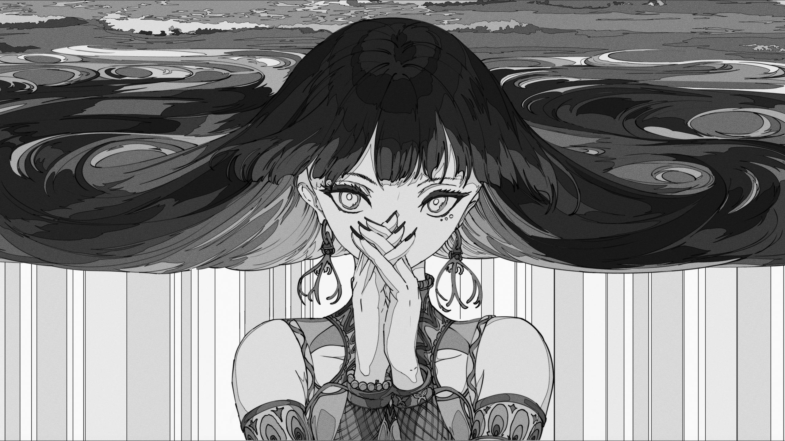

# Hyprshade

Improved UX for Hyprland shaders

> NOTE: Hyprshade is not an official Hyprland tool

<!-- markdownlint-disable no-inline-html heading-increment -->

<details>
  <summary>Screenshots</summary>

### Unfiltered


### Vibrance


### Blue Light Filter


### Color Filter (Red-Green)


### Color Filter (Green-Red)


### Color Filter (Blue-Yellow)


### Grayscale



### Invert Colors


</details>

<!-- markdownlint-enable no-inline-html heading-increment -->

## Features

- Easy to use CLI to swap shaders on the fly (e.g. `hyprshade on blue-light-filter`)
- [Scheduled shader activation](#scheduling)
- Includes shaders with [customizable appearance](#shader-customization):
  - `blue-light-filter`: use warmer colors to make the display easier on your
    eyes (similar to [f.lux][flux], [redshift][redshift], and [gammastep][gammastep])
  - `color-filter`: adjust colors for [color vision deficiencies][wiki-color-blindness]
  - `grayscale`: use shades of gray
  - `invert-colors`: invert colors so text and content stand out
  - `vibrance`: enhance color saturation
- Experimental support for user-defined shader templates

[flux]: https://justgetflux.com/
[gammastep]: https://gitlab.com/chinstrap/gammastep
[redshift]: http://jonls.dk/redshift/
[wiki-color-blindness]: https://en.wikipedia.org/wiki/Color_blindness

## Installation

### Arch Linux

Use your favorite AUR helper (e.g. [paru](https://github.com/Morganamilo/paru)):

```sh
paru -S hyprshade
```

Or manually:

```sh
sudo pacman -S --needed base-devel
git clone https://aur.archlinux.org/hyprshade.git
cd hyprshade
makepkg -si
```

### PyPI

If your distribution isn't officially supported, you can also install directly
from [PyPI](https://pypi.org/project/hyprshade/) with
[pipx](https://pypa.github.io/pipx/)[^1]:

```sh
pipx install hyprshade
```

[^1]: Installing with `pip` outside of a venv is unsupported.

## Usage

```text
Usage: hyprshade [OPTIONS] COMMAND [ARGS]...

Commands:
  auto     Set screen shader on schedule
  current  Print current screen shader
  install  Install systemd user units
  ls       List available screen shaders
  off      Turn off screen shader
  on       Turn on screen shader
  toggle   Toggle screen shader
```

You may specify a shader on the command line either by name:

```sh
hyprshade on blue-light-filter
```

...or by path name:

```sh
hyprshade on ~/.config/hypr/shaders/blue-light-filter.glsl
hyprshade on ./shaders/blue-light-filter.glsl
```

Given the shader name, Hyprshade will search directories in the following order:
`$HYPRSHADE_SHADERS_DIR`, `~/.config/hypr/shaders`,
`~/.config/hyprshade/shaders`, `/usr/share/hyprshade/shaders`.

### Configuration

Configuration enables features such as [scheduling](#scheduling) and [shader
appearance customization](#shader-customization), and is entirely optional.

Hyprshade reads the first configuration file found from the following locations:
`$HYPRSHADE_CONFIG`, `~/.config/hypr/hyprshade.toml`,
`~/.config/hyprshade/config.toml`.

#### Scheduling

> [!WARNING]
> For scheduling to work, `systemd --user` must have access to the environment variable
> `HYPRLAND_INSTANCE_SIGNATURE`.
>
> Add the following line to `hyprland.conf`[^2]:
>
> ```hypr
> exec-once = dbus-update-activation-environment --systemd HYPRLAND_INSTANCE_SIGNATURE
> ```
>
> [^2]: See also: [Hyprland FAQ][hyprland-faq-import-env] ([archive][hyprland-faq-import-env-archive])

[hyprland-faq-import-env]: https://wiki.hyprland.org/FAQ/#some-of-my-apps-take-a-really-long-time-to-open
[hyprland-faq-import-env-archive]: https://web.archive.org/web/20240226003306/https://wiki.hyprland.org/FAQ/#some-of-my-apps-take-a-really-long-time-to-open

To schedule a shader for activation during preferred periods of the day, specify
a `start_time` and `end_time`:

```toml
[[shaders]]
name = "vibrance"
default = true  # will be activated when no other shader is scheduled

[[shaders]]
name = "blue-light-filter"
start_time = 19:00:00
end_time = 06:00:00   # optional if more than one shader has start_time
```

Then, install and enable the [systemd user units][systemd-user-units]:

[systemd-user-units]: https://wiki.archlinux.org/title/Systemd/User

```sh
hyprshade install --enable
```

> [!TIP]
> Run `hyprshade install --enable` every time you make changes to
> `hyprshade.toml`.

Finally, to ensure the correct shader is activated when you log in, add the
following line to `hyprland.conf`:

```hypr
exec = hyprshade auto
```

#### Shader Customization

Shader appearance customization is done with the `shaders.config` table. See
["Shader Customization Reference"](#shader-customization-reference) for a
complete list of customizable properties.

<!-- markdownlint-disable no-inline-html -->

<details>
  <summary>Example: <code>blue-light-filter</code></summary>

#### `temperature = 2600.0`


#### `temperature = 4000.0`


</details>

<!-- markdownlint-enable no-inline-html -->

> [!TIP]
> You can also customize shaders with the `--var` CLI option:
>
> ```sh
> hyprshade on blue-light-filter --var temperature=5000.0
> ```

Internally, shader customization is implemented with
[Mustache](https://mustache.github.io/) templates (custom
[`uniform`](<https://www.khronos.org/opengl/wiki/Uniform_(GLSL)>) variables
aren't supported upstream). See [`shaders/`](./shaders) for some examples.

## Reference

### `shaders`

`shaders` is an [array of tables][toml-array-of-tables]. Each table can be
described as follows:

<!-- markdownlint-disable line-length -->

| Property     | Type                      | Description                                                                                             |
| ------------ | ------------------------- | ------------------------------------------------------------------------------------------------------- |
| `name`       | `string`                  | Name identifying the shader (**required**)                                                              |
| `default`    | `boolean`                 | If `true`, will be activated when no other shader is [scheduled](#scheduling) (default: `false`)        |
| `start_time` | [`time`][toml-local-time] | Start time for [scheduling](#scheduling)                                                                |
| `end_time`   | [`time`][toml-local-time] | End time for [scheduling](#scheduling) (if omitted, the next `start_time` chronologically will be used) |
| `config`     | [`table`][toml-table]     | [Shader customization](#shader-customization-reference)                                                 |

<!-- markdownlint-enable line-length -->

```toml
[[shaders]]
name = "vibrance"
default = true

[[shaders]]
name = "blue-light-filter"
start_time = 19:00:00
end_time = 06:00:00

[[shaders]]
name = "color-filter"
[shaders.config]
type = "red-green"
strength = 0.2
```

[toml-array-of-tables]: https://toml.io/en/v1.0.0#array-of-tables
[toml-local-time]: https://toml.io/en/v1.0.0#local-time
[toml-table]: https://toml.io/en/v1.0.0#table

### Shader Customization Reference

#### `blue-light-filter` configuration

<!-- markdownlint-disable line-length -->

| Property      | Type    | Possible Values      | Default  | Description                                                |
| ------------- | ------- | -------------------- | -------- | ---------------------------------------------------------- |
| `temperature` | `float` | `1000.0` – `40000.0` | `2600.0` | [Color temperature][wikipedia-color-temperature] in Kelvin |
| `strength`    | `float` | `0.0` – `1.0`        | `1.0`    | Strength of filter                                         |

<!-- markdownlint-enable line-length -->

```toml
[[shaders]]
name = "blue-light-filter"
[shaders.config]
temperature = 2600.0  # 1000.0 - 40000.0
strength = 1.0        # 0.0 - 1.0
```

[wikipedia-color-temperature]: https://en.wikipedia.org/wiki/Color_temperature

#### `color-filter` configuration

<!-- markdownlint-disable line-length -->

| Property   | Type     | Possible Values                         | Default     | Description                                                |
| ---------- | -------- | --------------------------------------- | ----------- | ---------------------------------------------------------- |
| `type`     | `string` | `red-green`, `green-red`, `blue-yellow` | `red-green` | [Type][wikipedia-color-blindness-type] of color correction |
| `strength` | `float`  | `0.0` – `1.0`                           | `0.2`       | Strength of filter                                         |

<!-- markdownlint-enable line-length -->

```toml
[[shaders]]
name = "color-filter"
[shaders.config]
type = "red-green"  # "red-green", "green-red", "blue-yellow"
strength = 0.2      # 0.0 - 1.0
```

[wikipedia-color-blindness-type]: https://en.wikipedia.org/wiki/Color_blindness#Based_on_affected_cone

#### `grayscale` configuration

<!-- markdownlint-disable line-length -->

| Property          | Type     | Possible Values                      | Default      | Description                                                                                                      |
| ----------------- | -------- | ------------------------------------ | ------------ | ---------------------------------------------------------------------------------------------------------------- |
| `type`            | `string` | `luminosity`, `lightness`, `average` | `luminosity` | Type of grayscale conversion                                                                                     |
| `luminosity_type` | `string` | `pal`, `hdtv`, `hdr`                 | `hdr`        | Formula used to calculate [relative luminance][wikipedia-grayscale-luma] (only applies to `type = "luminosity"`) |

<!-- markdownlint-enable line-length -->

```toml
[[shaders]]
name = "vibrance"
[shaders.config]
type = "luminosity"      # "luminosity", "lightness", "average"
luminosity_type = "hdr"  # "pal", "hdtv", "hdr"
```

[wikipedia-grayscale-luma]: https://en.wikipedia.org/wiki/Grayscale#Luma_coding_in_video_systems

#### `vibrance` configuration

<!-- markdownlint-disable line-length -->

| Property        | Type    | Possible Values | Default | Description                                               |
| --------------- | ------- | --------------- | ------- | --------------------------------------------------------- |
| `balance.red`   | `float` | `0.0` – `10.0`  | `1.0`   | Multiplier to vibrance strength (red)                     |
| `balance.green` | `float` | `0.0` – `10.0`  | `1.0`   | Multiplier to vibrance strength (green)                   |
| `balance.blue`  | `float` | `0.0` – `10.0`  | `1.0`   | Multiplier to vibrance strength (blue)                    |
| `strength`      | `float` | `-1.0` – `1.0`  | `0.15`  | Strength of filter (negative values will reduce vibrance) |

<!-- markdownlint-enable line-length -->

```toml
[[shaders]]
name = "vibrance"
[shaders.config]
balance = { red = 1.0, green = 1.0, blue = 1.0 }  # 0.0 - 10.0
strength = 0.15                                   # -1.0 - 1.0
```

## FAQ

### How do I dismiss error messages from Hyprland?

[`hyprctl seterror disable`]. (Contrary to what the command may seem to imply,
this does _not_ disable any further error messages.) You may also use
[`hyprctl reload`].

[`hyprctl seterror disable`]: https://wiki.hyprland.org/Configuring/Using-hyprctl/#seterror
[`hyprctl reload`]: https://wiki.hyprland.org/Configuring/Using-hyprctl/#reload

<!-- markdownlint-disable line-length -->

### I tried to copy something from the `examples/` or `shaders/` directory, but it's not working. What gives?

<!-- markdownlint-enable line-length -->

TL;DR: Hyprshade should work properly without needing to manually copy files.
If activating a shader with `hyprshade on` does not work out of the box, feel
free to [open a bug report].

[open a bug report]: https://github.com/loqusion/hyprshade/issues/new?template=bug_report.yml

If you try to copy things from the `main` branch while you are using a stable
release, it may not work properly. This repository has a single-branch
development scheme, where all development is done on the `main` branch and
stable versions are [pinned with
tags](https://github.com/loqusion/hyprshade/tags). The only exception to this is
that updates to the README pertaining to unreleased features are kept on
separate branches to avoid advertising features not present in any stable
version.

If you'd like to try out unreleased features, you can use a development version
of Hyprshade — currently, the only officially supported way to do this is to use
the [`hyprshade-git` AUR
package](https://aur.archlinux.org/packages/hyprshade-git).
